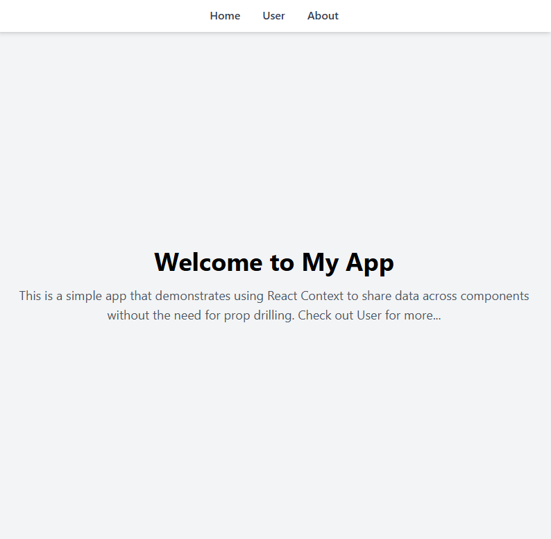
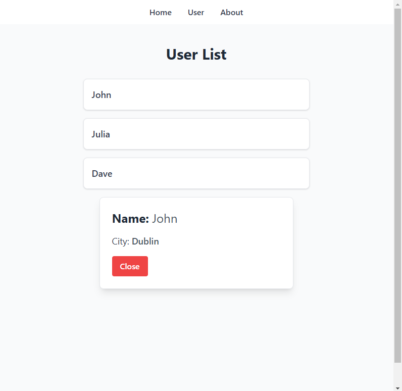

# 📚 Learining React Context

Welcome to my simple React app! This project demonstrates how to use **React Context** to manage and share data across components without prop drilling. Below, you'll find a complete guide on how to set up and explore this app.

---

## 🚀 Project Overview

This app is structured to show how data can be passed seamlessly between components using **React Context API**. No more tedious prop drilling!

### 🛠 Key Features
- **User List**: Displays a list of users with clickable links to view details.
- **User Details**: Shows detailed information for a selected user.
- **About Page**: Displays the creator's information.

---

## 📦 Installation

Follow these steps to set up the project on your local machine:

1. **Clone the repository**:
   ```bash
   git clone https://github.com/yourusername/your-repo-name.git
   ```

2. **Navigate to the project folder**:
   ```bash
   cd your-repo-name
   ```

3. **Install dependencies**:
   ```bash
   npm install
   ```

4. **Start the development server**:
   ```bash
   npm start
   ```

   The app should now be running at `http://localhost:3000`

---

## 🔍 App Screenshots

### 1. Home Page


*Description*: This page welcomes users and briefly explains the app's functionality.

### 2. User List Page


*Description*: Displays a list of users with clickable links to view their details.


*Description*: Contains information about the app creator.

---

## 🤝 Contributing

If you would like to contribute to this project:
1. Fork the repository.
2. Create a new branch: `git checkout -b feature/your-feature`
3. Make your changes and commit them: `git commit -m 'Add a new feature'`
4. Push to the branch: `git push origin feature/your-feature`
5. Open a pull request.

---

## 📝 License

This project is licensed under the [MIT License](LICENSE). Feel free to use and modify as you see fit!

---

## 💬 Contact

For any questions or suggestions, please contact:
- **Email**: your-email@example.com
- **GitHub**: [your-username](https://github.com/your-username)

---

## 🙏 Acknowledgments

- Thank you to [React](https://reactjs.org/) for the amazing library!
- Thanks to [Tailwind CSS](https://tailwindcss.com/) for making styling simple and fun.

---

Happy coding! 😊